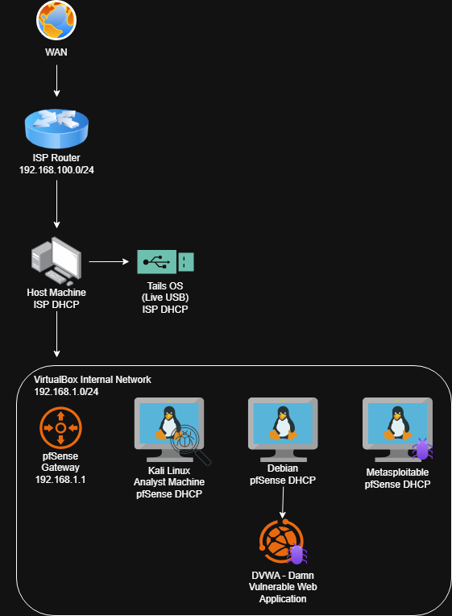

# Homelab
Índice da minha infraestrutura de estudo.

[**EN-US**](../README.md)

## Ambiente Implementado 

### 🖥️ Ambiente Host 
- [**VS Code IDE:**](https://github.com/DiogoZanini/VSCode-IDE-setup) Configuração do VSCode para desenvolvimento em C, Python e SQLite, estendendo o fluxo de trabalho do CS50.
- [**Tails Amnesic Incognito System:**](https://github.com/DiogoZanini/Portable-Linux-Tails) Configuração pessoal e notas operacionais para um ambiente de segurança amnésico em pendrive.

### 🌐 Infraestrutura do Homelab
- [**pfSense:**](https://github.com/DiogoZanini/pfSense) Gateway padrão para a rede do laboratório virtual, gerenciando roteamento e regras de firewall.

### 🔵 Blue Team / Detecção
- [**SOC Lab:**](https://github.com/DiogoZanini/SOC-Lab) Laboratório de Centro de Operações de Segurança para prática hands-on com SIEM, análise de logs, detecção de ameaças e fluxos de resposta a incidentes.

### 🔴 Red Team / Análise
- [**Kali Linux:**](https://github.com/DiogoZanini/Kali-Linux) Máquina virtual analista para análise de segurança do ambiente homelab e desafios CTF em plataformas de estudo online.

### 🎯 Superfície de Ataque (Alvos Vulneráveis)

**Sistemas Vulneráveis:**
- [**Metasploitable:**](https://github.com/DiogoZanini/Metasploitable) Máquinas virtuais intencionalmente vulneráveis para prática de testes de penetração e treinamento em segurança em múltiplas versões.

**Aplicações Web:**
- **DVWA (Damn Vulnerable Web Application)** — Em processo de documentação.

## Roadmap

**Completo:**
- [x] Máquina Host: VS Code IDE + Oracle VirtualBox;
- [x] Tails Amnesic Incognito System (USB Inicializável);
- [x] pfSense VM (Firewall/Roteador);
- [x] Kali Linux VM (Análise de Segurança);
- [x] VMs Metasploitable (versões 1 e 2);
- [x] Debian + DVWA;
- [x] SOC Lab (em progresso);

### 🎯 Superfície de Ataque (Alvos Vulneráveis)

**Aplicações Web:**
- [ ] OWASP Juice Shop;
- [ ] DVWA (Damn Vulnerable Web Application);

**Sistemas Vulneráveis:**
- [ ] Metasploitable3-ub1404 (Ubuntu);
- [ ] Metasploitable3-win2k8 (Windows);

### 🪟 Ambiente Windows

**Laboratório Active Directory:**
- [ ] Windows Server 2025 + Active Directory;

**Estações de Trabalho:**
- [ ] Windows 11 (Produção);
- [ ] Windows 10;

**Sistemas Legados (EOL):**
- [ ] Windows 7;
- [ ] Windows Vista;
- [ ] Windows XP;

**Análise de Malware (Isolado):**
- [ ] Windows 11 - Laboratório de Análise de Malware (Snapshot)
  - Ferramentas: Wireshark, IDA, x32dbg, x64dbg, ProcMon, ProcExp, Ghidra, DIE, HxD

### 🐧 Ambiente Linux
- [ ] Debian VM:
  - Snapshot: OWASP Juice Shop
  - Snapshot: DVWA

## Solução de Problemas
Problemas comuns e suas soluções.

[Guia completo de solução de problemas](./docs/TROUBLESHOOTING.md)

### Driver name clash (VERR_PDM_USB_NAME_CLASH)
- **Problema:** Drivers USB corrompidos/duplicados após reinstalação ou atualização.
- **Solução:** Reinstalar o VirtualBox do zero:
  1. Desinstalar o VirtualBox (aceitar a remoção de todos os componentes de rede/USB);
  2. Deletar `C:\Program Files\Oracle\VirtualBox` e `C:\Windows\System32\drivers\VBox*`;
  3. Reiniciar o sistema;
  4. Reinstalar pelo [virtualbox.org](https://www.virtualbox.org/).
